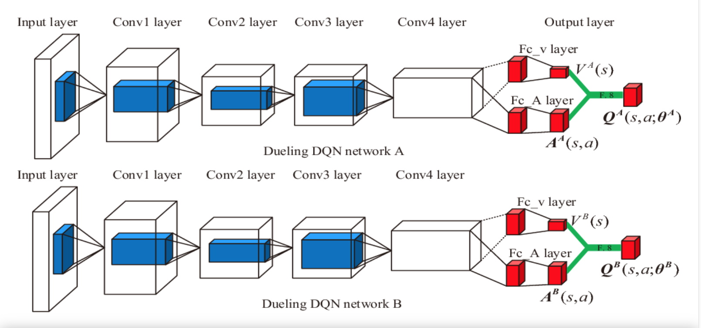
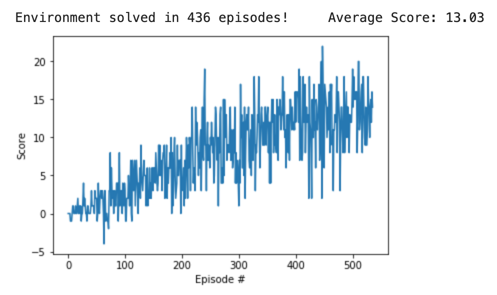

<!-- s -->

# Technical Report

## Learning Algorithm
The project implements a simplified version of a Double Dueling Deep Q Network (D3QN) where the convolutional layers are substituted with fully connected layers. The original architecture is described in this [paper](https://www.semanticscholar.org/paper/V-D-D3QN%3A-the-Variant-of-Double-Deep-Q-Learning-Huang-Wei/e6a1640c03c50a55ef3e00a0592dbb0851fe33bb) and [blog](https://medium.com/analytics-vidhya/introduction-to-dueling-double-deep-q-network-d3qn-8353a42f9e55).

<figure>
    
<figcaption>Fig 1: Original architecture for Dueling DQN</figcaption>
</figure>

## Hyper-parameters

| Hyper-parameter name | Value   | Detailed meaning                       |
| :---:                |:----:   | :---:                                  |
| Mini-batch           | 64      | Number of samples trained in each step |
| τ               | 1e-3    | Soft update for target network weights |
| update_frequency     | 4       | Update frequency for target network    |
| γ             | 0.99    | Discount factor                        |
| Replay buffer size   | 1e5     | Capacity of the replay buffer          |
| α	             | 5e-4    | Learning rate for gradient descent     |
| ϵ           |[0.01, 1]| The probability of an agent randomly choosing an action |
| ϵ decay     | 0.995   | Decay rate for epsilon                 |

## Plot of Rewards
The environment was solved in 436 episodes, a considerable improvement with respect to the baseline (1800 episodes).
<figure>
    
    <figcaption>Fig 2: Rewards</figcaption>
</figure>

## Ideas for Future Work

This project addressed a few of the various improvements to the original DQN algorithm. A comprehensive list can be found in the Rainbow DQN [paper](https://arxiv.org/pdf/1710.02298.pdf). 

The future work will address integrating prioritized rebuffering play as discussed in this [paper](https://arxiv.org/pdf/1511.05952.pdf) and many [blogs](https://towardsdatascience.com/how-to-implement-prioritized-experience-replay-for-a-deep-q-network-a710beecd77b).

## Other Resources
The author of the blog [Chris Yoon](https://github.com/cyoon1729/deep-Q-networks) has a few interesting examples of Deep Q Network.
